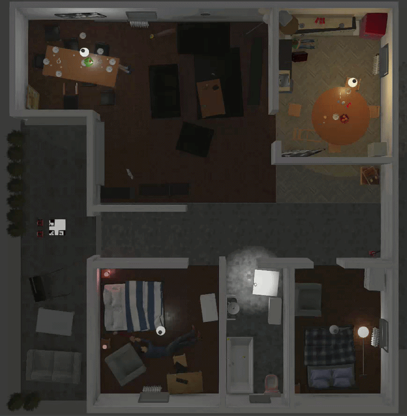
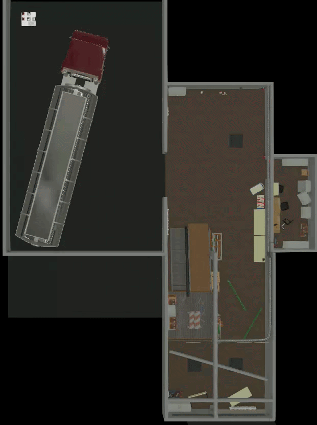
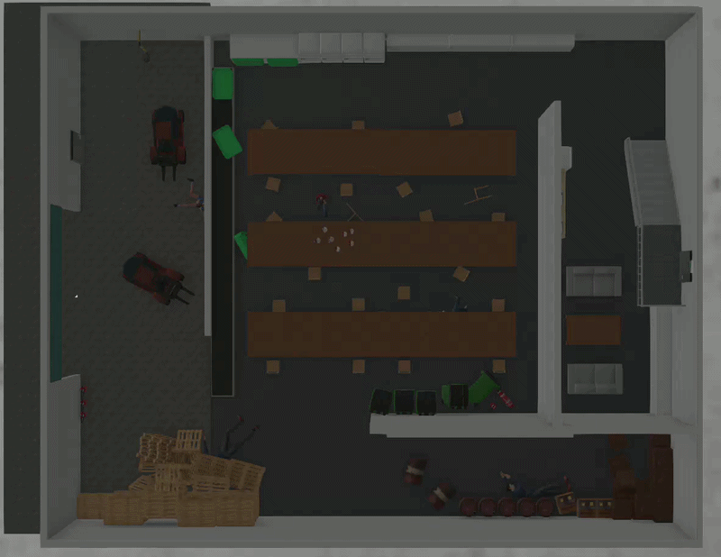

# Wolf Brigade — IEEE SMCS SAR Competition 2026 Phase 1

This repository contains Wolf Brigade's Python submission for the
[2026 IEEE SMCS Search and Rescue Competition — Phase 1](https://github.com/IEEE-SMCS/2026-ieee-smcs-competition-phase-1).

## How to install and run

Follow these steps in order.

### 1. Install the required software

- Webots **R2025a**
- Python **3.10.12** or another Python 3.10+ version
- Git and Git LFS
- An NVIDIA GPU

### 2. Put this solution in the test repository

The final evaluation uses an unseen test repository and unseen worlds. Use the
same folder placement with any test repository you have been given:

Set up Git LFS once:

```bash
git lfs install
```

Clone this repository directly with the required folder name:

```bash
git clone https://github.com/Gabriel-Twiggho/IEEE_2026_Phase_1_Wolf_Brigade_Submission.git proposed_solution
```

Replace the test repository's existing `controllers/proposed_solution` folder
with the newly cloned `proposed_solution` folder.

Leave every other file and folder in the test repository unchanged. Make sure
`proposed_solution.py`, `mission_extraction.py`, `requirements.txt`, and the
rest of this submission are directly inside that folder, without an extra
nested repository folder.

Open a terminal in `controllers/proposed_solution`. Run all remaining terminal
commands from this directory.

### 3. Create the Python virtual environment

#### Linux or macOS

```bash
python3.10 -m venv .venv
source .venv/bin/activate
python -m pip install --upgrade pip
python -m pip install -r requirements.txt
```

#### Windows PowerShell

```powershell
py -3.10 -m venv .venv
.venv\Scripts\Activate.ps1
python -m pip install --upgrade pip
python -m pip install -r requirements.txt
```

The Webots `controller` module is supplied by Webots and should not be
installed from PyPI.

### 4. Tell Webots to use the virtual environment

With the venv activated, print its full Python path:

```bash
python -c "import sys; print(sys.executable)"
```

Copy the printed path. In Webots, open
`Tools > Preferences > General`, set **Python command** to that path, and save
the settings.

### 5. Process the flyover recording

Look inside the test repository's `recordings` folder and use the exact name
of its `.mp4` file. Replace `YOUR_VIDEO_FILE.mp4` below with that filename:

```bash
python mission_extraction.py --video /recordings/YOUR_VIDEO_FILE.mp4
```

`/recordings/` is a shortcut for the `recordings` folder in whichever test
repository contains this solution. It is not an absolute filesystem path and
does not depend on a specific world name.

If the IMU file has the same filename as the video, the pipeline selects it
automatically. For example, `YOUR_VIDEO_FILE.mp4` will use
`YOUR_VIDEO_FILE.csv`.

If the IMU CSV has a different filename, provide both names:

```bash
python mission_extraction.py --video /recordings/YOUR_VIDEO_FILE.mp4 --imu /recordings/YOUR_IMU_FILE.csv
```

If the `/recordings/` shortcut does not work, use full absolute paths.

Linux or macOS:

```bash
python mission_extraction.py --video "/full/path/to/YOUR_VIDEO_FILE.mp4" --imu "/full/path/to/YOUR_IMU_FILE.csv"
```

Windows PowerShell:

```powershell
python mission_extraction.py --video "C:\full\path\to\YOUR_VIDEO_FILE.mp4" --imu "C:\full\path\to\YOUR_IMU_FILE.csv"
```

Wait until `MISSION EXTRACTION COMPLETE` is displayed. The command creates:

| Output | Purpose |
| --- | --- |
| `sim_logs/victim_location_estimates.csv` | Victim estimates for scoring and robot planning |
| `sim_logs/map_estimate.png` | Wall map for scoring and robot planning |
| `sim_logs/drone_path.csv` | UAV path used by the route planner |
| `sim_logs/map_estimate_info.json` | Map geometry used by the robots |

Add `--debug` to the command only if diagnostic images are required.

### 6. Start the autonomous mission

1. Open the matching `.wbt` world from the test repository's `worlds` folder
   in Webots.
2. Reload the world if it was already open when extraction completed.
3. Start the simulation.

Webots automatically launches `proposed_solution.py` for both ROSbots. Do not
run `proposed_solution.py` directly from a normal terminal.

## Solution overview

The solution has two connected stages:

1. **Flyover information extraction**
   - Estimates the UAV path from IMU data and the origin mat's ArUco markers.
   - Detects victims with a bundled Ultralytics YOLO segmentation model.
   - Segments walls with a bundled SegFormer model and creates the required
     binary `600 x 600` map.
2. **Two-robot autonomous mission**
   - Seeds planning from the extracted wall map, victim estimates and UAV
     path.
   - Balances victim assignments between both ROSbots.
   - Uses mapping, replanning, terrain handling and collision avoidance while
     searching for victims.
   - Confirms victims using a second bundled YOLO model and depth data before
     reporting them.

All model weights are included under `models/`; no model download or external
API is required at runtime.

## Test world results

### Small world

**Overall score:** 0.872/1.000 · **Victims found:** 4 · **Time taken:** 115.6 s



### Medium world

**Overall score:** 0.681/1.000 · **Victims found:** 4 · **Time taken:** 164.4 s



### Large world

**Overall score:** 0.763/1.000 · **Victims found:** 5 · **Time taken:** 119.1 s



## Main files

| Path | Purpose |
| --- | --- |
| `proposed_solution.py` | Webots controller entrypoint |
| `mission_extraction.py` | Flyover preprocessing entrypoint |
| `requirements.txt` | Python dependency versions |
| `extraction/` | UAV path, victim and wall-map extraction |
| `coordinator/` | Two-robot assignment and route planning |
| `robot/` | Sensing, mapping, navigation and victim reporting |
| `models/` | Bundled victim and wall models |
| `parameters.py` | Ground-controller defaults |
| `extraction/config/` | Flyover extraction settings |

## Authors

Utkrisht Jain
Gabriel Twigg-Ho

:)
